## Laptop-Shop 💻

> An E-Commerce Platform Built With The MERN Stack & Redux.💻


###### Home Page


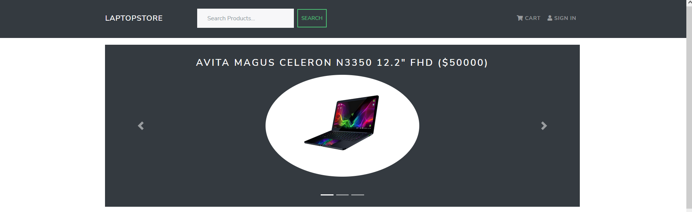


###### Latest Products
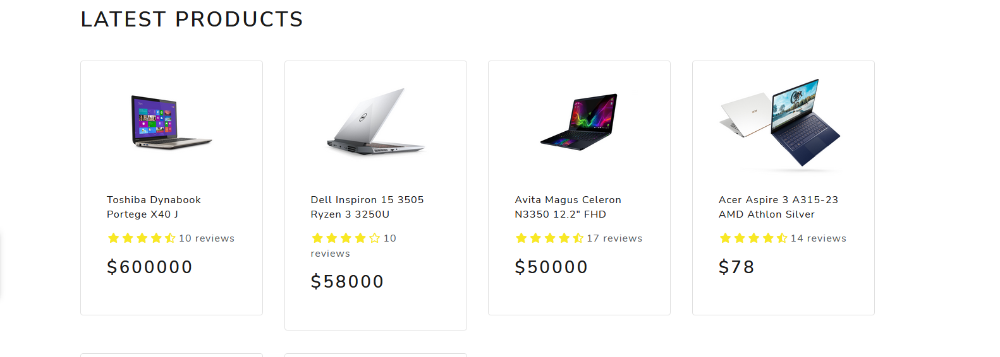


###### Footer


###### Client-Review
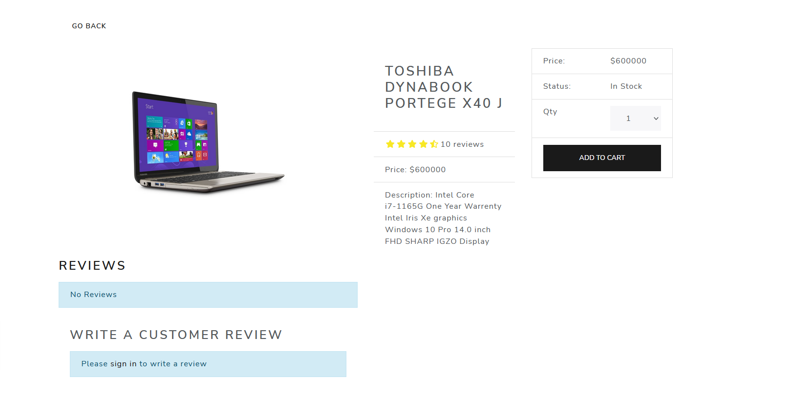


###### CheckOut
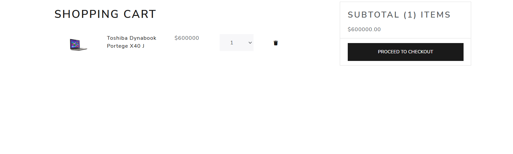


###### Singup & Login Page For Client
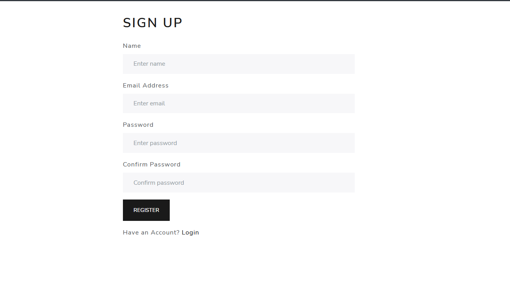


###### Shipping
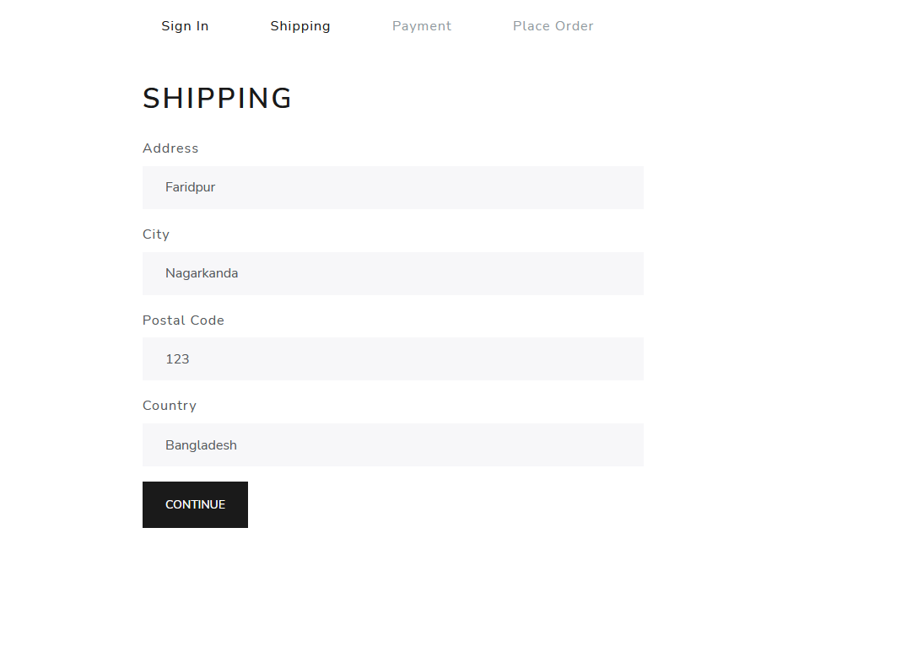


###### Payment 
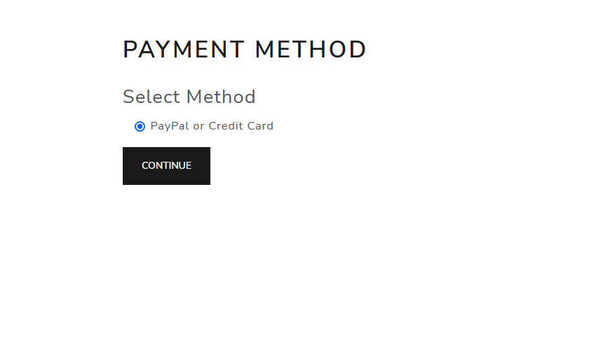


###### Order-Shipping
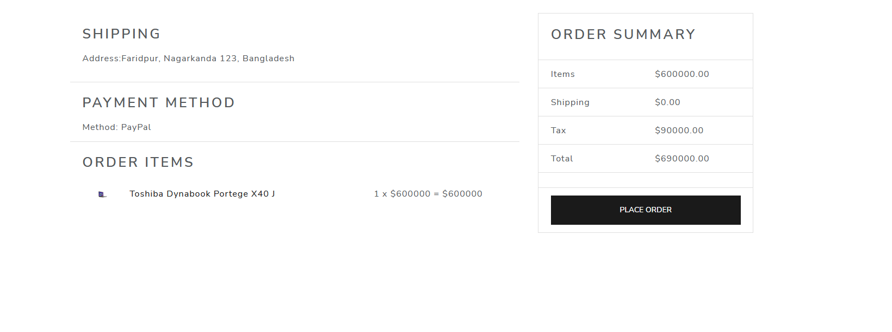


###### Order-History
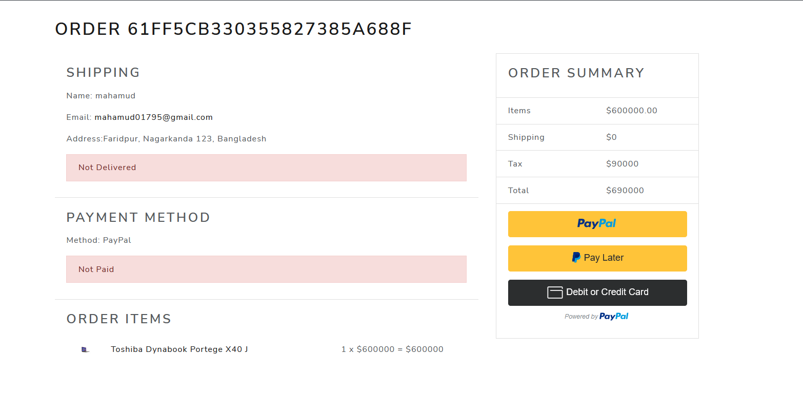


###### UserProfile-Update
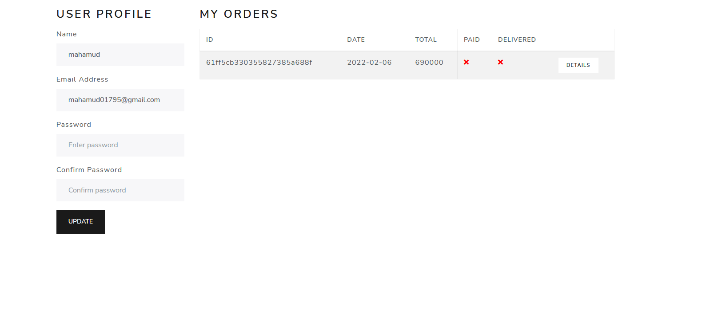


###### Admin Show Userlist
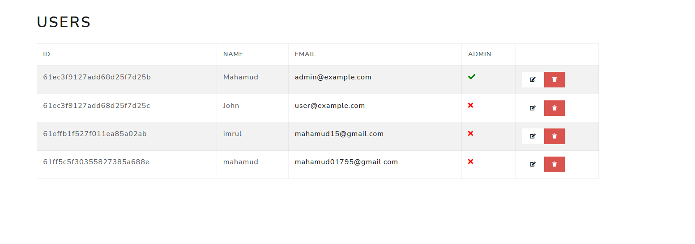


###### Products Create & Delete page for Admin
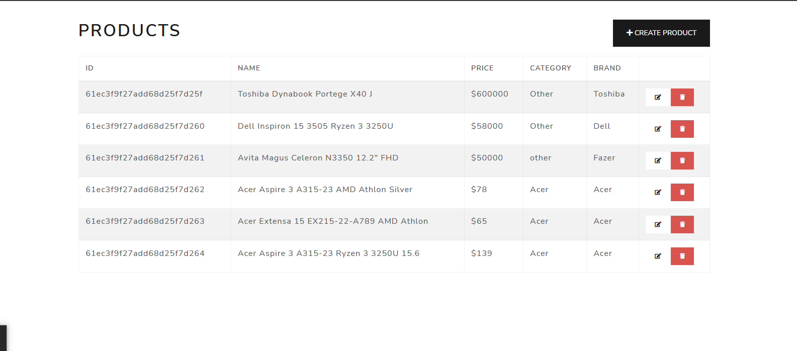


###### Show-Orderlist
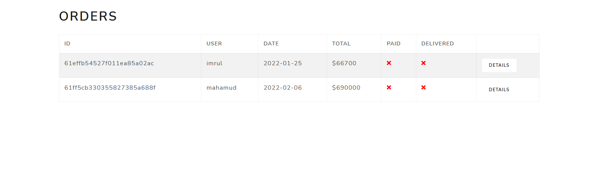


## Features

- Full featured of shopping cart
- Product reviews and ratings
- Top products carousel
- Product pagination
- Product search feature
- User profile with orders
- Admin product management
- Admin user management
- Admin Order details page
- Mark orders as delivered option
- Checkout process (shipping, payment method, etc)
- PayPal / credit card integration
- Database seeder (products & users)


### ES Modules in Node

We use ECMAScript Modules in the backend in this project. Be sure to have at least Node v14.6+ or you will need to add the "--experimental-modules" flag.

Also, when importing a file (not a package), be sure to add .js at the end or you will get a "module not found" error.

You can also install and setup Babel if you would like

### Env Variables

Create a .env file in then root and add the following

```
NODE_ENV = development
PORT = 5000
MONGO_URI = your mongodb uri
JWT_SECRET = 'abcde123'
PAYPAL_CLIENT_ID = your paypal client id
```

### Install Dependencies (frontend & backend)

```
npm install
cd frontend
npm install
```

### Run

```
# Run frontend (:3000) & backend (:5000)
npm run dev

# Run backend only
npm run server
```

## Build & Deploy

```
# Create frontend prod build
cd frontend
npm run build
```

There is a Heroku postbuild script, so if you push to Heroku, no need to build manually for deployment to Heroku

### Seed Database

You Can use the following commands to seed the database with some sample users and products as well as destroy all data

```
# Import data
npm run data:import

# Destroy data
npm run data:destroy
```

```
Sample User Logins

admin@example.com (Admin)
123456

john@example.com (Customer)
123456

jane@example.com (Customer)
123456
```


